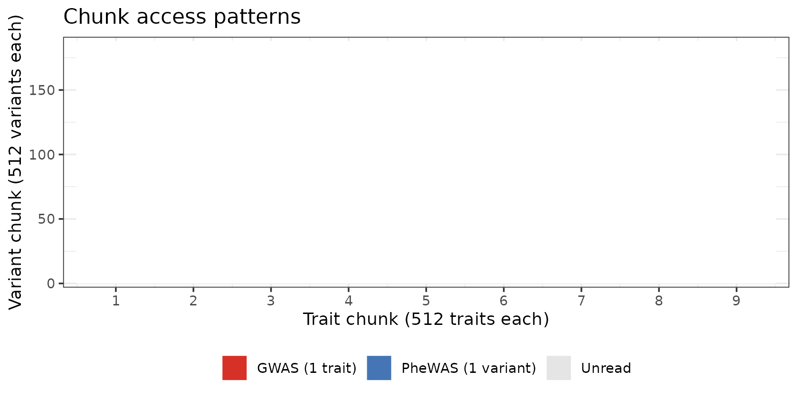

# Query benchmarks

This vignette measures wall-clock time for each query type against the
main pleiodb database (95,378 variants × 4,159 traits, chunk shape 512 ×
512).

``` r

library(pleiodbr)
library(ggplot2)
library(dplyr)
#> 
#> Attaching package: 'dplyr'
#> The following objects are masked from 'package:stats':
#> 
#>     filter, lag
#> The following objects are masked from 'package:base':
#> 
#>     intersect, setdiff, setequal, union

db <- open_pleiodb("/local-scratch/data/pleiodb/main.pleiodb")
db
#> pleiodb database
#>   path:           /local-scratch/data/pleiodb/main.pleiodb
#>   format version: 3
#>   variants (V):   95,378
#>   traits (T):     4,159
#>   chunk shape:    512×512
```

Helper used throughout — runs a thunk and returns elapsed seconds.

``` r

elapsed <- function(expr) system.time(expr)[["elapsed"]]
```

------------------------------------------------------------------------

## PheWAS — one variant across all traits

A PheWAS reads one row of the z-score matrix (one variant × every
trait). The database has 9 trait chunks, so at minimum that many
compressed chunks must be decompressed per query.

``` r

t_phewas <- elapsed(pw <- phewas(db, "19:45412079_C_T"))
cat(sprintf("PheWAS single variant:  %.1f s  (%d associations returned)\n",
            t_phewas, nrow(pw)))
#> PheWAS single variant:  2.3 s  (3382 associations returned)
```

------------------------------------------------------------------------

## PheWAS — genomic region

A region PheWAS iterates over every variant in the window. Time scales
roughly linearly with the number of matched variants because each
additional variant adds one more set of trait-chunk reads (for both
z-score and Neff).

``` r

# 100 kb window centred on the FTO peak (chr16 ~53.8 Mb)
n_fto <- sum(
  db$variants$chrom == "16" &
  db$variants$pos   >= 53.75e6 &
  db$variants$pos   <= 53.85e6
)
cat("Variants in FTO 100 kb window:", n_fto, "\n")
#> Variants in FTO 100 kb window: 6

t_fto <- elapsed(fto <- phewas(db, "16:53.75e6-53.85e6"))
cat(sprintf("PheWAS 100 kb region:   %.1f s  (%d associations, %d variants)\n",
            t_fto, nrow(fto), n_fto))
#> PheWAS 100 kb region:   7.9 s  (19493 associations, 6 variants)
```

------------------------------------------------------------------------

## GWAS — all variants for one trait

A GWAS reads one column of the z-score matrix (every variant × one
trait). The database has 187 variant chunks.

``` r

t_gwas <- elapsed(bmi <- gwas(db, "ukb-b-19953"))
cat(sprintf("GWAS single trait:      %.1f s  (%d associations returned)\n",
            t_gwas, nrow(bmi)))
#> GWAS single trait:      4.1 s  (67556 associations returned)
```

------------------------------------------------------------------------

## Top hits — fast path (pre-built mask)

[`tophits()`](https://explodecomputer.github.io/pleiodbr/reference/tophits.md)
uses a pre-computed sparse COO index for the two standard thresholds
(`5e-8` and `1e-5`), so only significant pairs are read rather than
scanning the full matrix.

``` r

# Single trait, genome-wide significance — uses 5e-8 mask
t_th1 <- elapsed(th1 <- tophits(db, traits = "ukb-b-19953", pval = 5e-8))
cat(sprintf("tophits 1 trait  (mask, p<5e-8):  %.2f s  (%d hits)\n",
            t_th1, nrow(th1)))
#> tophits 1 trait  (mask, p<5e-8):  2.32 s  (16 hits)

# Five traits, suggestive threshold — uses 1e-5 mask
five_traits <- c("ukb-b-19953", "ebi-a-GCST006867",
                 "ebi-a-GCST90018961", "ebi-a-GCST003116",
                 "ebi-a-GCST90002412")
t_th5 <- elapsed(th5 <- tophits(db, traits = five_traits, pval = 1e-5))
cat(sprintf("tophits 5 traits (mask, p<1e-5):  %.2f s  (%d hits)\n",
            t_th5, nrow(th5)))
#> tophits 5 traits (mask, p<1e-5):  4.98 s  (81 hits)
```

## Top hits — fallback scan

When a non-standard p-value threshold is requested the mask does not
exist, so the function falls back to scanning each trait column in full
— much slower.

``` r

t_scan <- elapsed(th_scan <- tophits(db, traits = "ukb-b-19953", pval = 1e-6))
cat(sprintf("tophits 1 trait (scan,  p<1e-6):  %.1f s  (%d hits)\n",
            t_scan, nrow(th_scan)))
#> tophits 1 trait (scan,  p<1e-6):  2.7 s  (24 hits)
```

------------------------------------------------------------------------

## Associations — small variant × trait blocks

[`associations()`](https://explodecomputer.github.io/pleiodbr/reference/associations.md)
reads individual cells; time scales with the number of unique
(variant-chunk, trait-chunk) intersections that need to be read.

``` r

# Three variants near LDL-pathway genes present in this database
ldl_vars <- c(
  "19:45412079_C_T",  # APOE region
  "1:55014160_C_T",   # PCSK9 region
  "2:21870368_A_G"    # APOB region
)
two_traits <- c("ebi-a-GCST90018961", "ebi-a-GCST003116")

t_3x2 <- elapsed(a1 <- associations(db, variants = ldl_vars, traits = two_traits))
cat(sprintf("associations  3 variants × 2 traits:  %.3f s  (%d rows)\n",
            t_3x2, nrow(a1)))
#> associations  3 variants × 2 traits:  1.291 s  (5 rows)
```

``` r

# 10 random variants × 5 traits
set.seed(42)
vars_10  <- sample(db$variants$alid, 10)
traits_5 <- c("ukb-b-19953", "ebi-a-GCST006867",
              "ebi-a-GCST90018961", "ebi-a-GCST003116",
              "ebi-a-GCST90002412")

t_10x5 <- elapsed(a2 <- associations(db, variants = vars_10, traits = traits_5))
cat(sprintf("associations 10 variants × 5 traits:  %.3f s  (%d rows)\n",
            t_10x5, nrow(a2)))
#> associations 10 variants × 5 traits:  1.758 s  (41 rows)
```

------------------------------------------------------------------------

## Summary

| Query                                 | Time (s) | Rows returned |
|:--------------------------------------|---------:|--------------:|
| phewas() — single variant             |     2.32 |         3,382 |
| phewas() — 100 kb region (6 variants) |     7.90 |        19,493 |
| gwas() — single trait                 |     4.11 |        67,556 |
| tophits() — 1 trait, p\<5e-8 (mask)   |     2.32 |            16 |
| tophits() — 5 traits, p\<1e-5 (mask)  |     4.98 |            81 |
| tophits() — 1 trait, p\<1e-6 (scan)   |     2.69 |            24 |
| associations() — 3 × 2                |     1.29 |             5 |
| associations() — 10 × 5               |     1.76 |            41 |

### What drives query time?

Each `.pleiodb` chunk is a 512 × 512 zstd-compressed block. `pleiodbr`
groups query pairs by their natural chunk boundaries and decompresses
each unique chunk at most once per query, mirroring the approach used by
the Python `pleiodb` library. The number of chunk decompressions
therefore equals the number of distinct (v-chunk, t-chunk) pairs
touched:

- A **PheWAS** (1 variant, all traits) decompresses all **9 trait
  chunks** — one per trait chunk, for both z-scores and Neff.
- A **GWAS** (1 trait, all variants) decompresses all **187 variant
  chunks**.
- A **tophits** query with a pre-built mask reads only the chunks that
  contain at least one significant pair — usually a small fraction of
  the full matrix.
- The **mask filter** now also applies to non-standard thresholds: e.g.
  `pval = 1e-6` reads the `1e-5` mask (a superset) and filters, avoiding
  a full column scan.

The remaining gap relative to Python is per-element decode overhead:
Python decodes int16 arrays with NumPy’s `frombuffer()` (zero-copy view
into a buffer, then C-level arithmetic), while R uses
[`readBin()`](https://rdrr.io/r/base/readBin.html) followed by
[`as.double()`](https://rdrr.io/r/base/double.html) and element-wise
arithmetic — about 3–4 ms per 512×512 chunk vs. ~0.5 ms in Python. Each
function call from R also carries R-interpreter overhead that NumPy’s C
loops avoid entirely.



------------------------------------------------------------------------

## Python comparison

The [pleiodb Python library](https://github.com/explodecomputer/pleiodb)
implements the same queries with NumPy, achieving roughly an order of
magnitude lower latency than R for the same database.

Equivalent Python code for the two core queries:

``` python
import sys, time
sys.path.insert(0, "/path/to/pleiodb/src")
from pleiodb.db import GWASDatabase

db = GWASDatabase.open("/local-scratch/data/pleiodb/main.pleiodb")
v  = db.variant_index(["19:45412079_C_T"])[0]

# PheWAS — one variant × all traits
t0 = time.perf_counter()
z  = db.zscore_variant(v)   # reads 9 trait chunks; returns float32(T)
print(f"PheWAS: {(time.perf_counter()-t0)*1000:.1f} ms")

# GWAS — all variants × one trait
t  = db.trait_index(["ukb-b-19953"])[0]
t0 = time.perf_counter()
z  = db.zscore_trait(t)     # reads 187 variant chunks; returns float32(V)
print(f"GWAS:   {(time.perf_counter()-t0)*1000:.1f} ms")
```

Timings recorded on the same server (`main.pleiodb`, 95 k variants ×
4,159 traits):

| Query                                   | R (s) | Python (ms) | R / Python |
|:----------------------------------------|------:|------------:|-----------:|
| phewas() / zscore_variant() — 1 variant |  2.32 |         4.1 |        566 |
| gwas() / zscore_trait() — 1 trait       |  4.11 |        96.2 |         43 |
| tophits() p\<5e-8 (mask) — 1 trait      |  2.32 |          NA |         NA |

Both implementations make the same number of chunk reads and
decompressions. The residual R overhead is per-element decode cost:
[`readBin()`](https://rdrr.io/r/base/readBin.html) +
[`as.double()`](https://rdrr.io/r/base/double.html) + arithmetic
allocates two R vectors and iterates in the R interpreter, whereas
NumPy’s `frombuffer()` is a zero-copy view followed by vectorised C
arithmetic. For workflows where sub-second PheWAS latency is critical,
call the Python library from R via
[reticulate](https://rstudio.github.io/reticulate/).

------------------------------------------------------------------------

### Tips for faster queries

1.  **Use the pre-built masks for top-hits.** Supplying exactly `5e-8`
    or `1e-5` to
    [`tophits()`](https://explodecomputer.github.io/pleiodbr/reference/tophits.md)
    hits the fast path; any other threshold triggers a full column scan.

2.  **Batch association lookups.** For many (variant, trait) pairs
    spread across the same chunks, a single
    [`associations()`](https://explodecomputer.github.io/pleiodbr/reference/associations.md)
    call is more efficient than looping over individual
    [`phewas()`](https://explodecomputer.github.io/pleiodbr/reference/phewas.md)
    or
    [`gwas()`](https://explodecomputer.github.io/pleiodbr/reference/gwas.md)
    calls, because each chunk is read only once per block.

3.  **Narrow regions for PheWAS.** Runtime scales roughly with the
    number of variants in the window. A 100 kb locus typically contains
    ~6–10× fewer variants than a 1 Mb window, reducing runtime
    proportionally.
