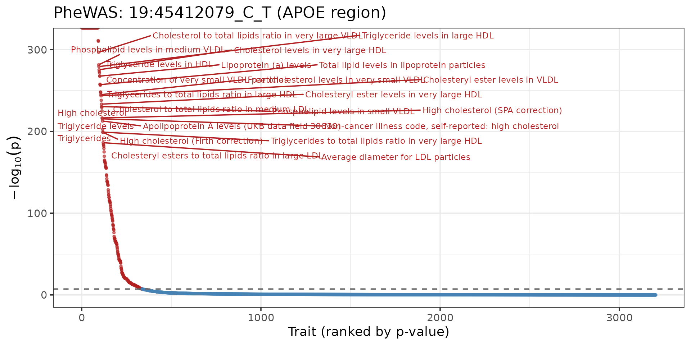
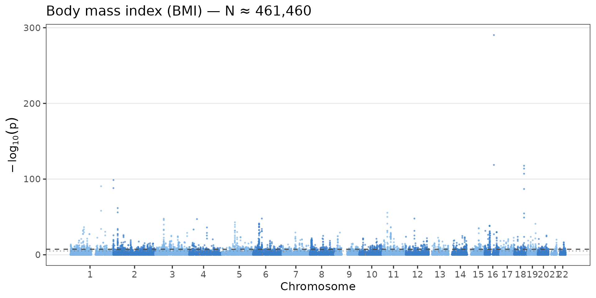
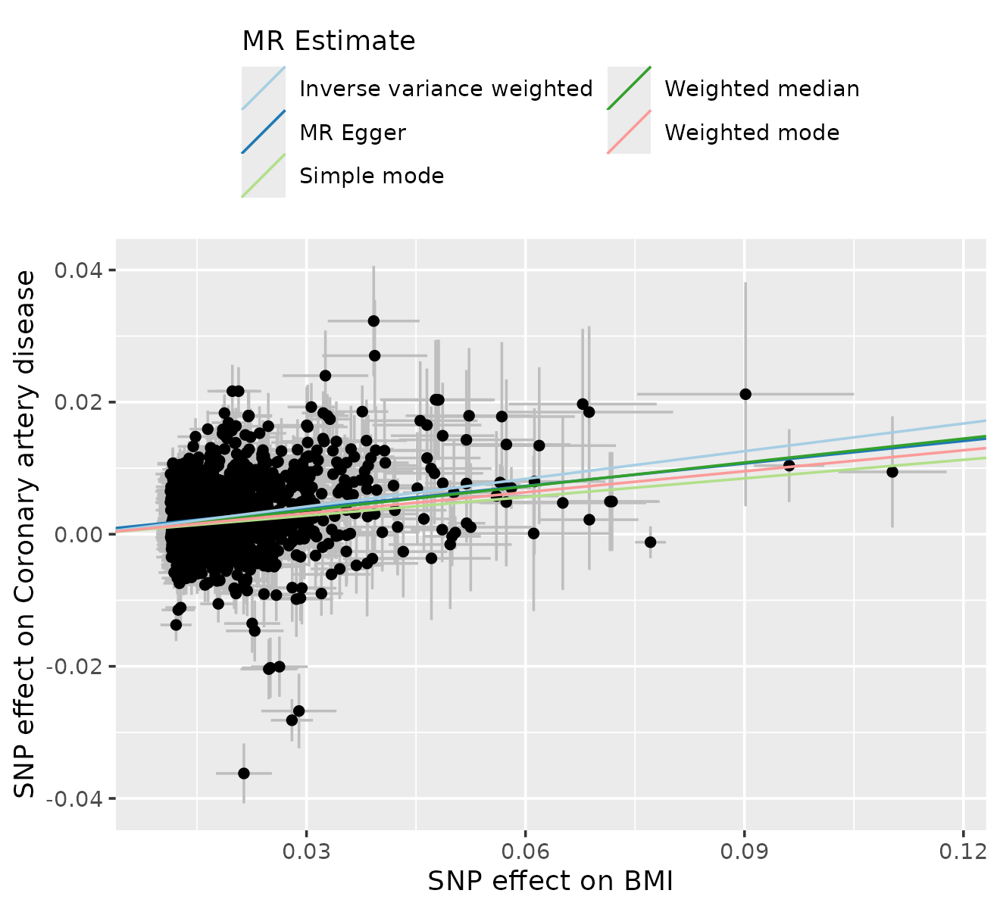
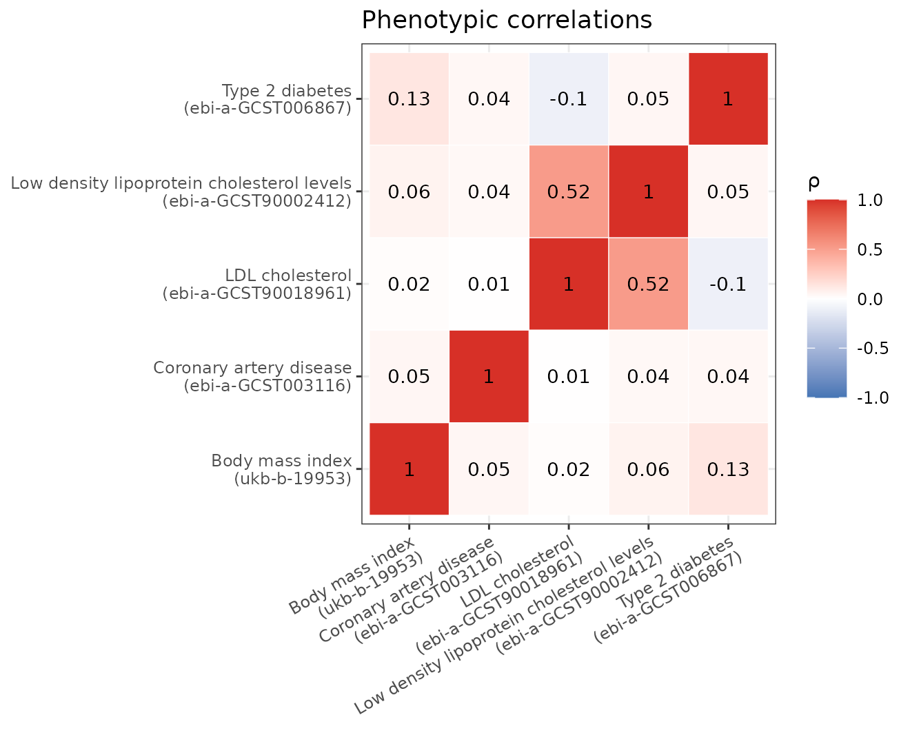
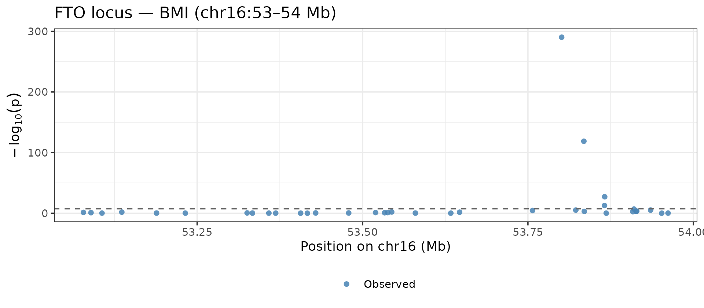

# Getting started with pleiodbr

`pleiodbr` reads `.pleiodb` databases — compact binary archives of GWAS
z-scores across thousands of traits — directly from R.

## Opening a database

``` r

library(pleiodbr)
library(ggplot2)
library(dplyr)
#> 
#> Attaching package: 'dplyr'
#> The following objects are masked from 'package:stats':
#> 
#>     filter, lag
#> The following objects are masked from 'package:base':
#> 
#>     intersect, setdiff, setequal, union

db <- open_pleiodb("/local-scratch/data/pleiodb/main.pleiodb")
db
#> pleiodb database
#>   path:           /local-scratch/data/pleiodb/main.pleiodb
#>   format version: 3
#>   variants (V):   95,378
#>   traits (T):     4,159
#>   chunk shape:    512×512
```

The connection holds variant and trait tables in memory and reads
z-scores on demand from the binary chunks.

------------------------------------------------------------------------

## Parsing ALIDs

[`parse_alid()`](https://explodecomputer.github.io/pleiodbr/reference/parse_alid.md)
splits ALID strings into chromosome, position, effect allele, and other
allele — useful for building annotation tables or MR inputs.

``` r

parse_alid(c("16:53800954_C_T", "19:45412079_C_T", "2:21231524_T_C"))
#> # A tibble: 3 × 5
#>   alid            chrom      pos ea    oa   
#>   <chr>           <chr>    <int> <chr> <chr>
#> 1 16:53800954_C_T 16    53800954 C     T    
#> 2 19:45412079_C_T 19    45412079 C     T    
#> 3 2:21231524_T_C  2     21231524 T     C
```

------------------------------------------------------------------------

## PheWAS — one variant across all traits

``` r

# APOE ε4 proxy: near-perfect LD with rs429358
pw <- phewas(db, "19:45412079_C_T")
nrow(pw)
#> [1] 3203
pw
#> # A tibble: 3,203 × 9
#>    variant_id     trait_id     z     beta      se     pval    eaf      n imputed
#>    <chr>          <chr>    <dbl>    <dbl>   <dbl>    <dbl>  <dbl>  <dbl> <lgl>  
#>  1 19:45412079_C… ebi-a-G… -6.5  -2.96e-1 0.0455  8.03e-11 0.0796 3.30e3 FALSE  
#>  2 19:45412079_C… ebi-a-G…  0.51  4.03e-2 0.0790  6.10e- 1 0.0796 1.09e3 FALSE  
#>  3 19:45412079_C… ebi-a-G…  1.89  3.07e-2 0.0163  5.88e- 2 0.0796 2.58e4 FALSE  
#>  4 19:45412079_C… ebi-a-G… -0.56 -1.19e-2 0.0212  5.75e- 1 0.0796 1.51e4 FALSE  
#>  5 19:45412079_C… ebi-a-G…  1.64  2.98e-2 0.0182  1.01e- 1 0.0796 2.07e4 FALSE  
#>  6 19:45412079_C… ebi-a-G…  0.64  8.75e-2 0.137   5.22e- 1 0.0796 3.65e2 FALSE  
#>  7 19:45412079_C… ebi-a-G…  0.82  5.47e-2 0.0667  4.12e- 1 0.0796 1.53e3 FALSE  
#>  8 19:45412079_C… ebi-a-G… -0.14 -8.69e-4 0.00621 8.89e- 1 0.0796 1.77e5 FALSE  
#>  9 19:45412079_C… ebi-a-G… -0.54 -3.35e-3 0.00620 5.89e- 1 0.0796 1.78e5 FALSE  
#> 10 19:45412079_C… ebi-a-G… -0.44 -2.73e-3 0.00621 6.60e- 1 0.0796 1.77e5 FALSE  
#> # ℹ 3,193 more rows
```

### PheWAS plot

``` r

pw_ann <- pw |>
  left_join(db$traits[, c("trait_id", "trait_name")], by = "trait_id") |>
  arrange(pval) |>
  mutate(x = row_number(), log10p = -log10(pval), sig = pval < 5e-8)

top_labels <- pw_ann |> filter(pval < 1e-20)

ggplot(pw_ann, aes(x, log10p, colour = sig)) +
  geom_point(size = 0.7, alpha = 0.6) +
  geom_hline(yintercept = -log10(5e-8), linetype = "dashed", colour = "grey40") +
  ggrepel::geom_text_repel(data = top_labels, aes(label = trait_name),
                           size = 2.5, max.overlaps = 15) +
  scale_colour_manual(values = c("FALSE" = "steelblue", "TRUE" = "firebrick"),
                      guide = "none") +
  labs(x = "Trait (ranked by p-value)", y = expression(-log[10](p)),
       title = "PheWAS: 19:45412079_C_T (APOE region)") +
  theme_bw(base_size = 11)
```



------------------------------------------------------------------------

## GWAS — all variants for one trait

``` r

bmi <- gwas(db, "ukb-b-19953")
nrow(bmi)
#> [1] 89823
```

### Manhattan plot

[`manhattan_plot()`](https://explodecomputer.github.io/pleiodbr/reference/manhattan_plot.md)
handles the chromosome offsets, alternating colours, and optional
imputed-variant highlighting automatically.

``` r

manhattan_plot(bmi, title = "Body mass index (BMI) — N ≈ 461,460")
```



------------------------------------------------------------------------

## Top hits

``` r

hits <- tophits(
  db,
  traits = c("ukb-b-19953", "ebi-a-GCST006867"),
  pval   = 5e-8
)
hits |>
  left_join(db$traits[, c("trait_id","trait_name")], by = "trait_id") |>
  count(trait_name, wt = NULL)
#> # A tibble: 2 × 2
#>   trait_name                n
#>   <chr>                 <int>
#> 1 Body mass index (BMI)  2077
#> 2 Type 2 diabetes         191
```

------------------------------------------------------------------------

## Associations — arbitrary variant × trait block

``` r

ldl_instruments <- c(
  "19:45412079_C_T",  # APOE region
  "1:55014160_C_T",   # PCSK9 region
  "2:21870368_A_G"    # APOB region
)
assoc <- associations(
  db,
  variants = ldl_instruments,
  traits   = c("ebi-a-GCST90018961",   # LDL cholesterol
               "ebi-a-GCST003116")     # Coronary artery disease
)
assoc
#> # A tibble: 6 × 9
#>   variant_id    trait_id       z     beta      se     pval    eaf      n imputed
#>   <chr>         <chr>      <dbl>    <dbl>   <dbl>    <dbl>  <dbl>  <dbl> <lgl>  
#> 1 19:45412079_… ebi-a-G… -119.   -0.526   0.00441 0        0.0796 3.51e5 FALSE  
#> 2 1:55014160_C… ebi-a-G…    1.98  0.0127  0.00639 4.77e- 2 0.725  6.14e4 FALSE  
#> 3 2:21870368_A… ebi-a-G…    1.94  0.0141  0.00727 5.24e- 2 0.975  3.84e5 FALSE  
#> 4 19:45412079_… ebi-a-G…   -6.5  -0.296   0.0455  8.03e-11 0.0796 3.30e3 FALSE  
#> 5 1:55014160_C… ebi-a-G…   -0.38 -0.00966 0.0254  7.04e- 1 0.725  3.88e3 FALSE  
#> 6 2:21870368_A… ebi-a-G…    0.61  0.0367  0.0602  5.42e- 1 0.975  5.62e3 FALSE
```

------------------------------------------------------------------------

## Mendelian randomisation: LDL → CAD

[`to_twosamplemr()`](https://explodecomputer.github.io/pleiodbr/reference/to_twosamplemr.md)
converts any pleiodbr result tibble directly into the format expected by
`TwoSampleMR`.

, “ebi-a-GCST90013864”

``` r

exposure <- tophits(db, "ukb-b-19953") |>
  to_twosamplemr("exposure", trait_name = "BMI")

outcome <- associations(db, exposure$SNP, "ebi-a-GCST90013864") |>
  to_twosamplemr("outcome", trait_name = "Coronary artery disease")

dat <- TwoSampleMR::harmonise_data(exposure, outcome, action = 1)
#> Harmonising BMI (ukb-b-19953) and Coronary artery disease (ebi-a-GCST90013864)
res <- TwoSampleMR::mr(dat)
#> Analysing 'ukb-b-19953' on 'ebi-a-GCST90013864'
res[, c("method", "nsnp", "b", "se", "pval")]
#>                      method nsnp          b          se          pval
#> 1                  MR Egger 2073 0.11363427 0.016539197  8.426264e-12
#> 2           Weighted median 2073 0.12057780 0.006267515  1.761253e-82
#> 3 Inverse variance weighted 2073 0.13969146 0.005267603 5.855651e-155
#> 4               Simple mode 2073 0.09389754 0.036452118  1.006624e-02
#> 5             Weighted mode 2073 0.10590915 0.031809157  8.852135e-04
```

### MR scatter plot

``` r

TwoSampleMR::mr_scatter_plot(res, dat)
#> $`ukb-b-19953.ebi-a-GCST90013864`
```



------------------------------------------------------------------------

## Phenotypic correlation (rho)

``` r

library(tidyr)

traits_5 <- c(
  "ukb-b-19953",        # BMI
  "ebi-a-GCST006867",   # Type 2 diabetes
  "ebi-a-GCST90018961", # LDL cholesterol
  "ebi-a-GCST003116",   # Coronary artery disease
  "ebi-a-GCST90002412"  # LDL (larger N)
)

rho_long <- rho(db, traits_5, traits_5)

labels <- db$traits |>
  filter(trait_id %in% traits_5) |>
  mutate(label = paste0(sub(" \\(.*", "", trait_name), "\n(", trait_id, ")")) |>
  select(trait_id, label)

rho_plot <- rho_long |>
  left_join(labels, by = c("trait_id_1" = "trait_id")) |> rename(l1 = label) |>
  left_join(labels, by = c("trait_id_2" = "trait_id")) |> rename(l2 = label)

ggplot(rho_plot, aes(l1, l2, fill = rho)) +
  geom_tile(colour = "white") +
  geom_text(aes(label = round(rho, 2)), size = 3) +
  scale_fill_gradient2(low = "#4575B4", mid = "white", high = "#D73027",
                       midpoint = 0, limits = c(-1, 1), name = "ρ") +
  labs(x = NULL, y = NULL, title = "Phenotypic correlations") +
  theme_bw(base_size = 9) +
  theme(axis.text.x = element_text(angle = 30, hjust = 1))
```

## 

## Regional locus plot

``` r

fto <- phewas(db, "16:53e6-54e6") |>
  filter(trait_id == "ukb-b-19953") |>
  mutate(pos_mb = as.numeric(sub(".*:(\\d+)_.*", "\\1", variant_id)) / 1e6)

ggplot(fto, aes(pos_mb, -log10(pval), colour = imputed, shape = imputed)) +
  geom_point(size = 1.8, alpha = 0.85) +
  scale_colour_manual(values = c("FALSE" = "steelblue", "TRUE" = "#E07B39"),
                      labels = c("Observed", "Imputed")) +
  scale_shape_manual(values = c("FALSE" = 16, "TRUE" = 17),
                     labels = c("Observed", "Imputed")) +
  geom_hline(yintercept = -log10(5e-8), linetype = "dashed", colour = "grey40") +
  labs(x = "Position on chr16 (Mb)", y = expression(-log[10](p)),
       colour = NULL, shape = NULL,
       title = "FTO locus — BMI (chr16:53–54 Mb)") +
  theme_bw(base_size = 11) +
  theme(legend.position = "bottom")
```


